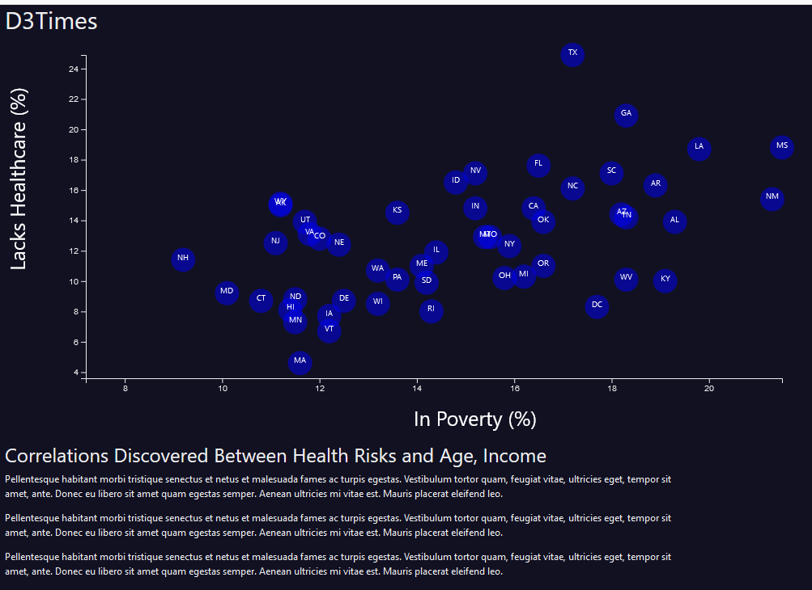

# D3 Project - Data Journalism and D3

## Background

Welcome to the newsroom! Our task is to help an editor of a major news paper who wants to run a series of
 
feature stories about the health risks facing particular demographics. We are going be analyze the current trends shaping 

people's lives, as well as creating charts, graphs, and interactive elements to help readers understand the findings.

We going to sift through information from the U.S. Census Bureau and the Behavioral Risk Factor Surveillance System.

The data set is based on 2014 ACS 1-year estimates: [Dataset](https://factfinder.census.gov/faces/nav/jsf/pages/searchresults.xhtml),
 
The current data set includes data on rates of income, obesity, poverty, etc. by state. MOE stands for "margin of error."

## Analysis

* Created a scatter plot between `Healthcare vs. In Poverty`.

* Plot represents each state with circle elements. 

* Plot include state abbreviations in the circles.

### Scatter Chart

